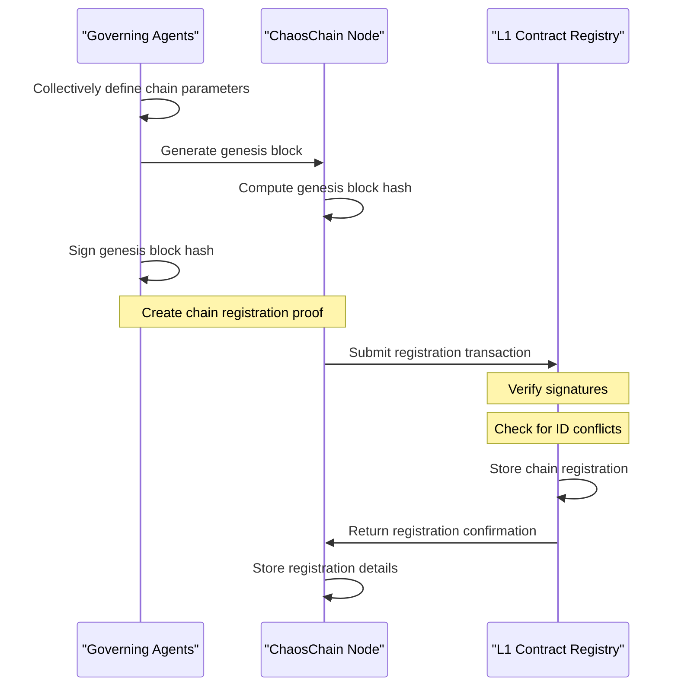

# Chain Identity System

## Overview

The ChaosChain identity system provides a secure, verifiable mechanism for chain identification and registration. Each chain is uniquely identified through multiple representations that are cryptographically linked to the chain's genesis block.

This system enables nodes to participate in multiple chains simultaneously while maintaining clear separation between chain instances and ensuring that transactions and operations are directed to the intended chain.

## Chain Identifier Format

Each ChaosChain has three forms of identification:

1. **Human-Readable Identifier** (String Format):
   ```
   cc-[namespace]-[chain-id]-[network]:g[genesis-short]
   ```
   
   Components:
   - `cc-`: Fixed prefix indicating a ChaosChain network
   - `[namespace]`: Organizational or purpose-based grouping (e.g., "finance", "research")
   - `[chain-id]`: Unique name for the specific chain
   - `[network]`: Optional network type (e.g., "mainnet", "testnet")
   - `:g[genesis-short]`: Abbreviated genesis block hash (first 6 characters) for verification

   Examples:
   - `cc-finance-derivatives-mainnet:g7a1e9f`
   - `cc-research-quantum-testnet:g3b8c2d`

2. **EVM-Compatible Identifier** (Integer Format):
   - A unique integer compatible with EVM chain ID conventions
   - ChaosChain reserves the range from 6,660,000 to 6,669,999
   - Used for transaction signing and EVM compatibility

3. **Genesis Block Hash** (Cryptographic Identifier):
   - SHA-256 hash of the chain's genesis block
   - Serves as the immutable cryptographic identifier
   - Used for definitive chain verification

## Registration Process



The registration process follows these steps:

1. **Genesis Creation**
   - Governing agents collectively define the initial chain parameters
   - A genesis block is generated based on these parameters
   - The system computes the cryptographic hash of this genesis block

2. **Proof Generation**
   - A threshold of founding agents (e.g., 2/3 majority) sign the genesis block hash
   - These signatures form a collective attestation of the genesis block's validity
   - The signatures, genesis block, and requested chain IDs are packaged as a proof

3. **L1 Registration**
   - The proof is submitted to the ChaosChain Registry contract on the L1 blockchain
   - The contract verifies the agent signatures against known public keys
   - It checks for conflicts with existing human-readable and EVM chain IDs
   - Upon successful verification, it registers the chain's identifiers

4. **Registration Confirmation**
   - The L1 contract emits an event confirming successful registration
   - The node stores the registration transaction hash and block number
   - This creates an auditable record of chain creation and registration

## Chain Identity Verification

Participants can verify a chain's identity through several mechanisms:

1. **Genesis Hash Verification**
   - Compare the locally computed genesis block hash with the registered hash
   - This provides cryptographic certainty about chain identity

2. **L1 Contract Query**
   - Query the L1 contract directly using any of the three identifiers
   - Verify that all identifiers match the expected values

3. **Abbreviated Hash Check**
   - For a quick check, verify that the abbreviated genesis hash in the human-readable ID matches the full genesis hash

## Chain Evolution and Lineage

When chains need to evolve beyond what's possible with normal governance:

1. **Chain Deprecation**
   - The current chain is marked as deprecated in the L1 registry
   - A successor relationship is established with the new chain

2. **Chain Migration**
   - State migration tools help transfer assets and state to the new chain
   - The original chain ID remains in the registry with its deprecated status

3. **Lineage Tracking**
   - The system maintains a chain's "family tree" for historical reference
   - This preserves relationships between chains over time

## EVM Compatibility

The integer chain ID format is fully compatible with Ethereum Virtual Machine standards:

1. **Transaction Signing**
   - EIP-155 transaction signing uses the integer chain ID to prevent replay attacks
   - Standard `eth_chainId` RPC methods return the correct ID

2. **Wallet Integration**
   - Wallets can display chain information using standard EIP-3085 format
   - Users see consistent chain identification across different interfaces

3. **Cross-Chain Compatibility**
   - The integer format works with existing cross-chain bridges and tooling
   - No modifications needed for EVM-based interoperability solutions

## Related Documentation

- [L1 Contract Integration](/technical-architecture/l1-integration/registry-contract) - Details on the L1 chain registry contract
- [Chain ID API](/developer-resources/api/chain-id-api) - API endpoints for chain identification
- [Horizontal Scalability](/technical-architecture/node-modifications/horizontal-scalability) - How nodes manage multiple chains 