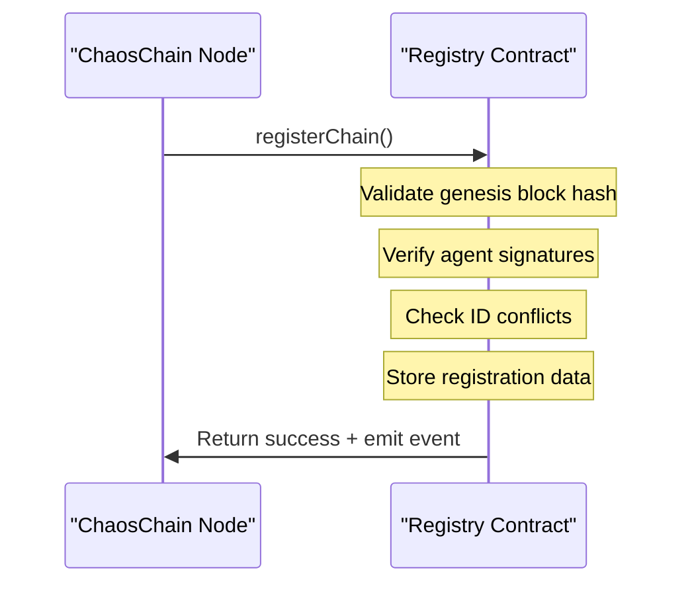

# Chain Registry Contract

## Overview

The Chain Registry Contract is the cornerstone of ChaosChain's identity system. Deployed on secure L1 blockchains, this contract provides a trustless, immutable registry that maps between different chain identifiers and maintains a verifiable record of chain creation and evolution.

## Contract Functionality

The registry contract provides several core functions:

1. **Chain Registration** - Records new chains with their identifiers and genesis block hash
2. **Chain Resolution** - Resolves any identifier to retrieve the full chain information
3. **Chain Metadata** - Stores additional metadata about registered chains
4. **Chain Lifecycle** - Manages chain deprecation and successor relationships

## Data Structures

```solidity
struct ChainRegistration {
    string humanReadableId;     // e.g., "cc-finance-derivatives-mainnet"
    uint256 evmChainId;         // EVM-compatible integer ID
    bytes32 genesisBlockHash;   // Hash of genesis block
    address registrar;          // Address that registered this chain
    uint256 registrationTime;   // Block timestamp of registration
    bool isActive;              // Whether chain is active or deprecated
    mapping(string => string) metadata; // Additional chain metadata
}

// Main registry mappings
mapping(bytes32 => ChainRegistration) public chainsByGenesisHash;
mapping(string => bytes32) public chainsByHumanId;
mapping(uint256 => bytes32) public chainsByEvmId;
```

## Contract Interface

```solidity
interface IChaosChainRegistry {
    // Events
    event ChainRegistered(
        string indexed humanReadableId,
        uint256 indexed evmChainId,
        bytes32 indexed genesisBlockHash,
        address registrar
    );
    
    event ChainDeprecated(
        bytes32 indexed genesisBlockHash,
        bytes32 indexed successorGenesisHash
    );
    
    event MetadataUpdated(
        bytes32 indexed genesisBlockHash,
        string key,
        string value
    );
    
    // Registration
    function registerChain(
        string calldata humanReadableId,
        uint256 requestedEvmChainId,
        bytes32 genesisBlockHash,
        bytes calldata genesisBlockHeader,
        bytes calldata genesisProof,
        string[] calldata metadataKeys,
        string[] calldata metadataValues
    ) external returns (bool);
    
    // Chain Resolution
    function resolveChainByGenesisHash(bytes32 genesisHash) external view returns (
        string memory humanReadableId,
        uint256 evmChainId,
        bool isActive,
        address registrar,
        uint256 registrationTime
    );
    
    function resolveChainByHumanId(string calldata humanReadableId) external view returns (
        bytes32 genesisHash,
        uint256 evmChainId,
        bool isActive,
        address registrar,
        uint256 registrationTime
    );
    
    function resolveChainByEvmId(uint256 evmChainId) external view returns (
        bytes32 genesisHash,
        string memory humanReadableId,
        bool isActive,
        address registrar,
        uint256 registrationTime
    );
    
    // Chain Lifecycle
    function deprecateChain(bytes32 genesisHash, bytes32 successorGenesisHash) external returns (bool);
    
    function setChainSuccessor(bytes32 genesisHash, bytes32 successorGenesisHash) external returns (bool);
    
    // Metadata Management
    function updateChainMetadata(
        bytes32 genesisHash,
        string calldata key,
        string calldata value
    ) external returns (bool);
    
    function getChainMetadata(
        bytes32 genesisHash,
        string calldata key
    ) external view returns (string memory);
    
    // Chain Enumeration
    function getChainCount() external view returns (uint256);
    
    function getChainAtIndex(uint256 index) external view returns (bytes32 genesisHash);
}
```

## Chain Registration Process



The registration process involves several key validations:

1. **Genesis Hash Verification**
   - The contract verifies that the provided genesis block header hashes to the claimed genesis hash
   - This ensures the integrity of the genesis block data

2. **Signature Verification**
   - The contract verifies that the genesis proof contains valid signatures from a threshold of authorized agents
   - This prevents unauthorized chain registrations

3. **ID Conflict Resolution**
   - The contract checks for conflicts with existing human-readable and EVM chain IDs
   - This prevents duplicate identifiers that could lead to confusion or attacks

## Chain Resolution

Chain resolution is a critical function that allows applications to:

1. **Verify Chain Identity**
   - Confirm that a chain's claimed identifiers match those in the registry
   - This prevents impersonation attacks

2. **Discover Chain Information**
   - Retrieve metadata and status information about a chain
   - This facilitates seamless integration with new chains

3. **Track Chain Evolution**
   - Follow successor relationships between chains
   - This maintains continuity through chain evolution

## Security Considerations

The contract implements several security measures:

1. **Access Control**
   - Chain metadata updates are restricted to authorized parties
   - Chain deprecation requires appropriate permissions
   - Function-level access controls prevent unauthorized modifications

2. **Data Validation**
   - Human-readable IDs must conform to the specified format
   - EVM chain IDs must fall within the reserved range
   - Input validation prevents malicious inputs

3. **Gas Optimization**
   - Operations are optimized to minimize gas costs
   - Batch operations reduce transaction overhead

## Deployment Information

The Registry Contract is deployed at the following addresses:

| Network          | Contract Address | Deployment Block |
|------------------|------------------|------------------|
| Ethereum Mainnet | *TBD*            | *TBD*            |
| Ethereum Sepolia | *TBD*            | *TBD*            |

## Integration Examples

### Registering a New Chain

```typescript
const humanReadableId = "cc-finance-derivatives-mainnet";
const evmChainId = 6660001;
const genesisBlockHash = "0x7a1e9f15...";
const genesisBlockHeader = "0x...";
const genesisProof = "0x...";

const tx = await registryContract.registerChain(
  humanReadableId,
  evmChainId,
  genesisBlockHash,
  genesisBlockHeader,
  genesisProof,
  ["description", "website"],
  ["Finance derivatives chain", "https://finance.chaoschain.network"]
);

const receipt = await tx.wait();
console.log(`Chain registered at block ${receipt.blockNumber}`);
```

### Resolving Chain Information

```typescript
// By human-readable ID
const chainInfo = await registryContract.resolveChainByHumanId("cc-finance-derivatives-mainnet");
console.log(`Genesis hash: ${chainInfo.genesisHash}`);
console.log(`EVM chain ID: ${chainInfo.evmChainId}`);

// By EVM chain ID
const chainInfo2 = await registryContract.resolveChainByEvmId(6660001);
console.log(`Genesis hash: ${chainInfo2.genesisHash}`);
console.log(`Human ID: ${chainInfo2.humanReadableId}`);
``` 